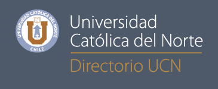

# UCN Contact Agenda

### Mobile java application that obtains telephone directory records from UCN
#### [(Universidad Católica del Norte)](http://admision01.ucn.cl/directoriotelefonicoemail/Default.aspx?ind=func/Default.aspx)

## Techstack
This app uses these open projects to work properly
- [jsoup: Java HTML Parser](jsoup.org)
- [google/gson: A Java serialization/deserialization library](https://github.com/google/gson)

## Members
- Luis Rojas Olivera, email: laro15mil@gmail.com.
-
